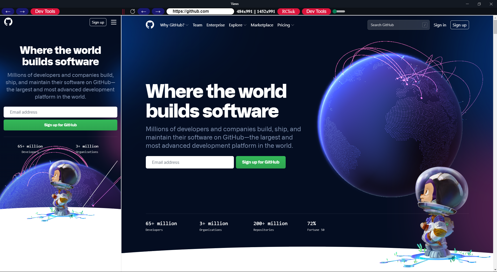

# WebViewPages

An app that lets you see how your webapplication/webapp shows in Mobile view and Full view at the same time.

## Usage

The [views folder](./views/) contains the electron app. Assuming you have [npm](https://www.npmjs.com) or [yarn](https://www.yarnpkg.com) installed, clone the repo, go inside the [views folder](./views/) and run the following code:

```
npm install && npm start

or

yarn install && yarn start
```

To build the .exe file for your own OS run the following code:

```
npm run make

or 

yarn run make
```

## Examples

Electron app
<br>
<p align="center">
  
</p>